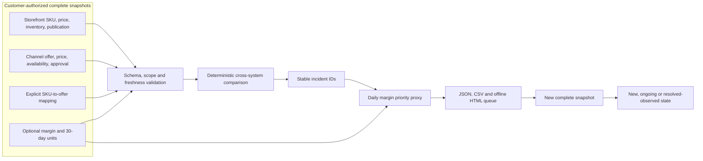
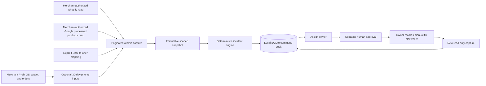
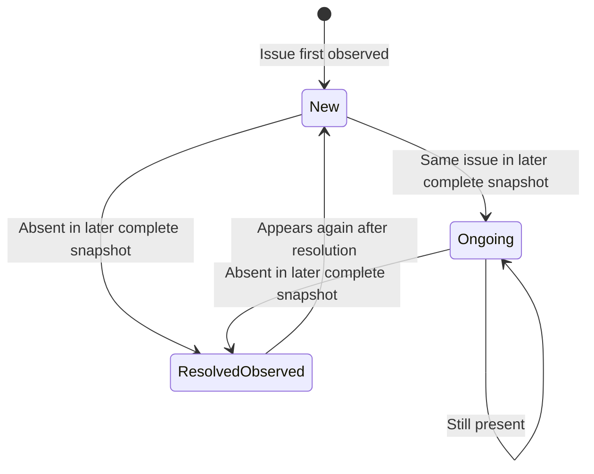

# Commerce Incident Network

**Find channel listing incidents, prioritize them with a transparent commerce-economics proxy, assign a human fix, and observe whether the issue disappears in the next complete snapshot.** This is the open-source core of **A2Z Commerce Command**: a local pilot for one USD merchant, country, reporting context, language, and feed label. It includes read-only Shopify and Google Merchant API capture, a SQLite operator desk, an optional Merchant Profit OS economics adapter, and an offline dashboard. The connectors are implemented and tested with mocked API responses; they have **not** been exercised against a merchant account in this repository. There is no webhook listener, hosted service, or automated platform write.

**Start with the [Shopify and Google Merchant Center product-diagnostics page](https://aah20.github.io/commerce-incident-network/)** for a reproducible, fictional two-snapshot example. The [technical diagnostic guide](docs/SHOPIFY_GOOGLE_MERCHANT_DIAGNOSTICS.md) explains the exact questions this tool can answer, checked-in verifiable reports, and the limits of each finding.

```bash
PYTHONPATH=src python3 -m commerce_incident_network run fixtures/demo/day1 outputs/day1 --as-of 2026-09-24T12:00:00Z
PYTHONPATH=src python3 -m commerce_incident_network run fixtures/demo/day2 outputs/day2 --as-of 2026-09-25T12:00:00Z --previous outputs/day1/report.json
PYTHONPATH=src python3 -m commerce_incident_network verify fixtures/demo/day2 outputs/day2/report.json --previous outputs/day1/report.json
PYTHONPATH=src python3 -m unittest discover -s tests -v
```

Open `outputs/day2/dashboard.html`. The demo begins with a disapproved book, a price mismatch, and an availability mismatch. The second complete snapshot shows the book and price incident absent while the availability mismatch continues. These are **fictional records**, and `resolved_observed` is not a claim about why the issue disappeared or how much revenue it recovered.

Run the local operator workflow with the same fictional records:

```bash
PYTHONPATH=src python3 -m commerce_incident_network.desk_cli outputs/demo-desk.sqlite sync fixtures/demo/day1 --as-of 2026-09-24T12:00:00Z --actor operator
PYTHONPATH=src python3 -m commerce_incident_network.desk_cli outputs/demo-desk.sqlite list --active-only
# Use an ID from the list command for assign, approve, and record-fix.
PYTHONPATH=src python3 -m commerce_incident_network.desk_cli outputs/demo-desk.sqlite sync fixtures/demo/day2 --as-of 2026-09-25T12:00:00Z --actor operator
PYTHONPATH=src python3 -m commerce_incident_network.desk_cli outputs/demo-desk.sqlite dashboard outputs/demo-command.html
```

See [Commerce Command pilot architecture and runbook](docs/COMMERCE_COMMAND.md) for capture commands and the case workflow.

## Why this exists

A merchant can see a product in the storefront while a sales channel sees something else. A channel diagnostic can tell the operator *what* is wrong, but an operator still has to join source and destination identities, decide what to handle first, assign the correction, and check that the next channel state reflects it. This repository implements the comparison and observation steps. It does not claim to replace platform diagnostics or act on their behalf.







## What the first release detects

| Incident | Signal | Operator next step |
| --- | --- | --- |
| Channel missing | Published mapped SKU absent from complete channel snapshot | Check feed and eligibility |
| Channel disapproved or pending | Channel approval field | Review the channel's issue details |
| Price mismatch | Storefront and channel USD prices differ | Check discounts and intended channel price |
| Availability mismatch | Published storefront stock state differs from channel | Check inventory policy and feed timing |
| Unpublished storefront item live in channel | Storefront unpublished, channel approved and in stock | Review publication and listing intent |
| Storefront missing | Mapped SKU absent from complete storefront snapshot | Check mapping and source export |

Every incident has a stable ID based on merchant, source account IDs, country, reporting context, content language, feed label, SKU, and kind. `--previous` compares only the same scope and an older snapshot. The engine refuses incomplete, future-dated, or stale snapshots so that a partial export cannot masquerade as a resolution. The output contains SHA-256 hashes of source files. `verify` recomputes the report from those same files; it does not authenticate the original platform. Snapshot schema v1.1 adds source account IDs; existing v1.0 manifests need those fields before reuse.

The optional priority proxy is `unit_margin_usd × units_sold_30d ÷ 30`. It uses historical sales velocity to order work within a severity class. It is **not** lost sales, causal revenue recovery, a forecast, or a reliable estimate for low-volume products. Missing economics produces a blank proxy, never a fabricated zero. Price and availability differences may be intentional promotions, backorders, or propagation lag; a human should decide the action.

## Data contract and safe operation

See [the exact CSV and manifest contract](docs/DATA_CONTRACT.md). Put actual merchant data under `customer-data/`, which Git ignores, and keep outputs under `outputs/`. Never commit credentials, customer exports, or unredacted reports. CSV output neutralizes formula-leading cells; HTML escapes source values and has no external scripts.

The input contract is deliberately narrow: one merchant, one market, one reporting context, one content language and feed label, USD, and one explicit SKU-to-offer mapping. It does not silently match products by title, perform currency conversion, infer variant-level availability from aggregate inventory, or label a missing channel record as a platform disapproval. Approved merchant exports can be transformed into this contract after the merchant validates the mapping and snapshot completeness.

## Existing A2Z components

[Merchant Profit OS](https://github.com/AAH20/merchant-profit-os) supplies a separate catalog/economics reference. The optional `economics-from-mpos` command now reads its published CSV contract to derive current modeled unit margin and gross 30-day units for mapped SKUs; this is a file-level adapter, not a live integration or realized contribution calculation. [A2Z Commerce Cash Control](https://github.com/AAH20/a2z-commerce-cash-control) addresses order-to-ledger reconciliation; this project addresses storefront-to-channel listing incidents. Neither cash reconciliation nor channel incident resolution proves incremental sales. [AttentionOS Bench](https://github.com/AAH20/attentionos-bench) remains a separate path for testing marketing effectiveness.

## Deployment sequence

1. **Consented pilot:** one merchant, one channel account, a named owner and separate reviewer. Validate a complete product mapping and compare the queue with the channel's own diagnostics. Record false positives and operator minutes. The read-only adapters are present but require real account credentials and a field-mapping review before use. [Shopify API](https://shopify.dev/docs/api/admin-graphql/latest/queries/productVariants) · [Google processed products](https://developers.google.com/merchant/api/reference/rest/products_v1/accounts.products/list)
2. **Operational hardening:** handle promotions, backorders, multichannel publication, currencies, variant/location inventory, OAuth refresh, API throttling, and channel processing delay. Google says processed products can lag after updates, so one absence in the next snapshot is an observation, not proof of causality. [Google processed products](https://developers.google.com/merchant/api/reference/rest/products_v1/accounts.products/list)
3. **Hosted commercial operations:** authenticated agency workspace, tenant-scoped storage, webhook ingestion, notifications, signed human approvals, and support commitments. Any future write-back needs explicit merchant authorization, idempotency, rollback, and independent verification.
4. **Broader channels:** add channel-specific adapters only after measured pilot precision. OpenAI shopping-feed onboarding is currently limited to approved partners; this repository does not claim access or certification. [OpenAI commerce guide](https://developers.openai.com/commerce/guides/get-started)

The first pilot should measure incident precision against manually reviewed cases, time to detection and observed resolution, reviewer minutes per 100 products, and the fraction of mapped products covered by complete snapshots. For a commercial agency product, test whether multi-merchant operation reduces those minutes enough to pay for connector maintenance, support, and secure hosting. Growth through agencies is a distribution hypothesis, not a guaranteed network effect.

Licensed under MIT. See [LICENSE](LICENSE).
