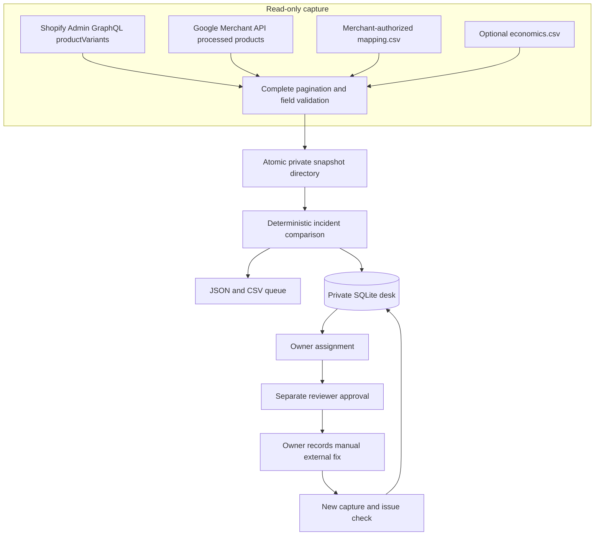

# A2Z Commerce Command: local pilot architecture

Commerce Command is a civilian operations desk for a narrow, measurable problem: a storefront and a shopping channel disagree about a mapped product, or the channel reports that the product is ineligible. It is built inside this repository so there is one incident model, one data contract, and no second synthetic command-center engine.



The capture command requires exact host/account shapes, bearer credentials from environment variables, all API pages, a single USD Shopify shop, one Google country/context/language/feed-label slice, supported inventory semantics, and an explicit one-to-one mapping. It refuses ambiguous statuses, sale-price promotions, backorders, negative or untracked inventory, and duplicate mapped SKUs. These exclusions are deliberate: silently normalizing them would create false incidents. A failed capture leaves no published snapshot. Tokens are not saved in the snapshot. Completing pagination does not make the two platforms transactionally consistent; merchants should review incidents near recent catalog changes before acting.

## Capture a merchant-authorized snapshot

Place `mapping.csv` and `economics.csv` in a private template directory. `economics.csv` may contain only its header. The merchant must verify that the mapping covers the intended cohort and authorize read access to both accounts. Set `SHOPIFY_ADMIN_TOKEN` and `GOOGLE_MERCHANT_ACCESS_TOKEN` in the process environment through an approved secret mechanism; do not put them in shell history, source files, or the repository.

```bash
PYTHONPATH=src python3 -m commerce_incident_network capture \
  customer-data/template customer-data/snapshots/2026-09-24 \
  --shop-domain example.myshopify.com --google-account 123456789 \
  --merchant-id merchant-one --country US --context SHOPPING_ADS \
  --language en --feed-label US

PYTHONPATH=src python3 -m commerce_incident_network run \
  customer-data/snapshots/2026-09-24 outputs/2026-09-24 \
  --as-of 2026-09-24T12:00:00Z
```

Use the actual capture timestamp returned by the command to choose an `--as-of` at or after capture; do not copy the sample timestamp. The Shopify connector requests variant SKU, price, aggregate inventory quantity and policy, product status, and online-store `publishedAt`; the Google connector requests processed products and the country/context destination status. Shopify `ACTIVE` alone does not prove publication, so the connector requires `publishedAt` as well. [Shopify product publication](https://shopify.dev/docs/api/admin-graphql/latest/objects/product) · [Google product status](https://developers.google.com/merchant/api/reference/rest/products_v1/accounts.products)

The connector currently receives supplied access tokens; it does not implement OAuth installation or refresh. The Google Merchant API requires authorization, and Shopify access must be granted by the merchant. A shared production service must implement the platforms' supported authorization flows, token rotation, revoke handling, rate limits, and data deletion. [Shopify authentication](https://shopify.dev/docs/apps/build/authentication-authorization) · [Google Merchant authorization](https://developers.google.com/merchant/api/guides/authorization/overview)

## Use Merchant Profit OS economics

If the merchant has a complete 30-day Merchant Profit OS `orders.csv` and a current `catalog.csv`, the file-level adapter can create `economics.csv` for mapped SKUs:

```bash
PYTHONPATH=src python3 -m commerce_incident_network economics-from-mpos \
  customer-data/mpos customer-data/template/mapping.csv \
  customer-data/template/economics.csv --as-of-date 2026-09-24 \
  --market US --attest-complete-orders
```

The adapter uses catalog `price - unit_cost - fulfillment_cost` and **gross** ordered units over the inclusive 30-day window. It does not subtract refunds, ad spend, shipping or processor costs; it does not reconstruct historical unit margin. The merchant must attest order completeness. The resulting figure orders the queue; it is not estimated lost or recovered revenue.

## Operator state machine

```mermaid
stateDiagram-v2
    [*] --> Open: Incident first observed
    Open --> Assigned: Named owner
    Assigned --> ApprovedManualFix: Different reviewer and rationale
    ApprovedManualFix --> AwaitingVerification: Owner records manual external fix
    Assigned --> ResolvedObserved: Issue absent in later complete snapshot
    AwaitingVerification --> ResolvedObserved: Issue absent in later complete snapshot
    AwaitingVerification --> Assigned: Incident details changed; approval invalidated
    ResolvedObserved --> Open: Issue recurs
```



The desk never invokes a platform write. `record-fix` is a human declaration that an action happened elsewhere. `resolved_observed` requires a newer complete snapshot, but the event does not prove that the declared fix caused resolution. The desk rejects repeated or older snapshots, scope changes, mapping changes, self-approval, and approval without rationale. Its SQLite event log is a local pilot record, not an immutable or independently authenticated audit trail.

```bash
PYTHONPATH=src python3 -m commerce_incident_network.desk_cli customer-data/desk.sqlite \
  sync customer-data/snapshots/2026-09-24 --as-of 2026-09-24T12:00:00Z --actor operator-one
PYTHONPATH=src python3 -m commerce_incident_network.desk_cli customer-data/desk.sqlite list --active-only
PYTHONPATH=src python3 -m commerce_incident_network.desk_cli customer-data/desk.sqlite \
  assign CASE_ID --owner owner-one --actor lead-one
PYTHONPATH=src python3 -m commerce_incident_network.desk_cli customer-data/desk.sqlite \
  approve CASE_ID --actor reviewer-two --note 'Reviewed proposed correction'
PYTHONPATH=src python3 -m commerce_incident_network.desk_cli customer-data/desk.sqlite \
  record-fix CASE_ID --actor owner-one --note 'Corrected source listing manually'
```

Run a second `capture`, then `sync` it. The dashboard is generated with `commerce_incident_network.desk_cli customer-data/desk.sqlite dashboard outputs/command.html`. It is a static local file, not a multi-user web app.

## Pilot scorecard and commercialization gate

| Measure | Definition | First-pilot source |
| --- | --- | --- |
| Actionable precision | Human-confirmed actionable incidents / reviewed incidents | Reviewer decisions |
| Time to detect | First qualifying source/channel observation minus earliest known issue time | Platform timestamps, if available |
| Time to observed resolution | First complete clean snapshot minus first incident snapshot | Desk snapshots |
| Operator effort | Minutes spent triaging and resolving each case | Time log |
| Cohort coverage | Mapped products with unambiguous source and channel fields / intended mapped products | Capture logs |
| Connector reliability | Complete successful captures / scheduled capture attempts | Job logs |

Do not quote a sales lift from these metrics. A commercial agency service becomes defensible only if real accounts show sufficiently precise incidents, repeated use, lower operator cost, and paid retention. The potential paid components are OAuth onboarding, secure multi-tenant storage, scheduled collection, alert routing, team identity, support, and customer-specific SLA operations. The comparison engine, schemas, local replay, and tests stay in the open-source repository.
